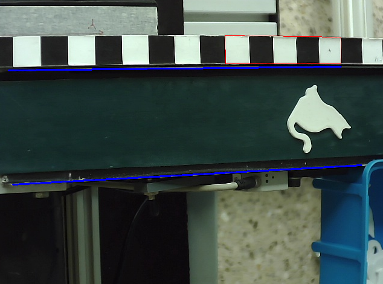

## This File contians all kind  of decisions.

### 1. Default zyclic node/topic-frequency
The Node Frequency and the corresponding publishing frequency should be 10Hz by default. Therefore the messages should be published ever 0.1s even if the content may be empty.  
If the Frequency should be different in some nodes or topics this is has to be documented especially.  
The reason for the 10Hz as a default value is the estimated sweetspot between speed and performance.

### 2. Position as List instead of Tuple
In the development process, the initial idea was to store the position as a tuple. However, for the postion prediction we changed our implementation to use a list instead. This is beneficial because the x-coordinate can be modified more easily, since lists are mutable while tuples are not.

### 3. Plausibility Check in Vision logic aswell as in position prediction Logic
The question who, the prediction logic or the vision pipeline, should do a plausibility check for the calculated and/or transformed coordinates was discussed in the team. As result the best option was an external class or function so both logic units can use the plausibility check. The vision can proof the seen coordinates and the position-prediction can proof the updated coordinates for plausibility.

### 4. Axis offset is stored in the AxisControllerNode not in the Axis logic.
For responsibility of axis-values of the Axis class, the sensor-offset of each axis got excluded. This decision was made, because the Axis class should work for coordinates in the RCS, therefor the AxisControllerNode should be responsible for translating the coordinates into RCS, which includes the adaption of sensor-values.


### Kamera-Ausrichtung mit digitalem Overlay

Dieses Skript zeigt ein digitales Overlay über dem Live-Kamerabild und dient dazu,
die Kamera reproduzierbar auf eine definierte Position auszurichten.



Durch fest einprogrammierte Referenzlinien kann die Kamera nach einer Verdrehung oder
Verschiebung wieder exakt so positioniert werden, dass bestimmte Objekte oder Bereiche
im Bild immer an der gleichen Stelle erscheinen. Das Overlay selbst verändert das
Kamerabild nicht, es wird nur zur Anzeige darübergelegt.

## Anleitung

1. Skript starten:
```bash
   python3 vision/camera/camera_alignment.py
```

2. Das Kamerafenster öffnet sich mit den eingeblendeten Referenzlinien.

3. Kamera physisch ausrichten, bis die relevanten Objekte mit den Referenzlinien
   übereinstimmen:
   - Das **rote Kästchen** (oben im Bild) markiert die Zielzone für ein bestimmtes Objekt
   - Die **blauen Linien** definieren zwei horizontale Referenzlienien im Bild

4. Sobald alles passt, Kamera fixieren — die Position ist damit dokumentiert und
   jederzeit wiederherstellbar.

## Steuerung

| Taste | Funktion                        |
|-------|---------------------------------|
| `ESC` | Programm beenden                |
| `F`   | Vollbild / Fenstermodus wechseln |
