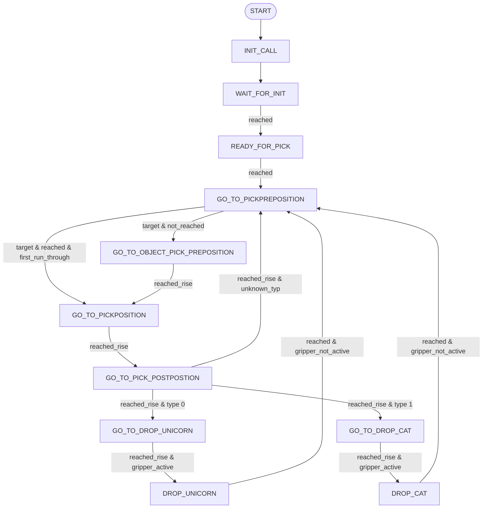

# NimSortMain – API-Referenz

## Klasse `NimSortMain`

Erbt von `MainInterface`.

State Machine für die NimSort-Sortierlogik. Verwaltet Bewegungszustände und entscheidet anhand von Vision-Predictions, ob ein Objekt gegriffen werden kann.

---

## Enum `ProcessId`

Kommunikations-IDs zwischen `NimSortMain` und dem Axis Controller. Wird als vierter Rückgabewert von `state_machine()` verwendet.

| Name | Wert |
|---|---|
| `SELF_INIT` | `0` |
| `INIT_AXIS` | `1` |
| `GO_TO_POS` | `2` |
| `PICKING_DRIVE` | `3` |
| `GO_TO_POS_WITH_GRIPPER` | `4` |
| `DEACTIVATE_GRIPPER` | `5` |

---

## Enum `NimSortState`

| Zustand | Wert |
|---|---|
| `START` | `"START"` |
| `INIT_CALL` | `"INIT_CALL"` |
| `WAIT_FOR_INIT` | `"WAIT_FOR_INIT"` |
| `READY_FOR_PICK` | `"READY_FOR_PICK"` |
| `GO_TO_PICKPREPOSITION` | `"GO_TO_PICKPREPOSITION"` |
| `GO_TO_OBJECT_PICK_PREPOSITION` | `"GO_TO_OBJECT_PICK_PREPOSITION"` |
| `GO_TO_PICKPOSITION` | `"GO_TO_PICKPOSITION"` |
| `GO_TO_PICK_POSTPOSTION` | `"GO_TO_PICK_POST"` |
| `GO_TO_DROP_CAT` | `"GO_TO_DROP_CAT"` |
| `GO_TO_DROP_UNICORN` | `"GO_TO_DROP_UNICORN"` |
| `DROP_CAT` | `"DROP_CAT"` |
| `DROP_UNICORN` | `"DROP_UNICORN"` |
| `DROP` | `"DROP"` |
| `GO_TO_BECHER` | `"GO_TO_BECHER"` |

---

## Konstruktor

### `__init__(self)`

Initialisiert die State Machine mit Startzustand `NimSortState.START` und setzt alle internen Felder zurück.

---

## Öffentliche Methoden

### `set_current_state(motion_state: NimSortState) -> None`

Setzt den aktuellen Zustand der State Machine manuell.

| Parameter | Typ | Beschreibung |
|---|---|---|
| `motion_state` | `NimSortState` | Zielzustand |

**Rückgabe:** `None`

---

### `get_current_state() -> NimSortState`

Gibt den aktuellen Zustand der State Machine zurück.

**Rückgabe:** `NimSortState` – aktueller Zustand

---

### `set_motion_state(reached: bool, gripper_active: bool) -> None`

Aktualisiert den Bewegungsstatus des Roboters.

| Parameter | Typ | Beschreibung |
|---|---|---|
| `reached` | `bool` | `True`, wenn die aktuelle Zielposition erreicht wurde |
| `gripper_active` | `bool` | `True`, wenn der Greifer aktiv (geschlossen) ist |

**Rückgabe:** `None`

---

### `set_conveyorbelt_speed(speed: float) -> None`

Setzt die aktuelle Förderbandgeschwindigkeit für interne Positionsberechnungen.

| Parameter | Typ | Beschreibung |
|---|---|---|
| `speed` | `float` | Geschwindigkeit des Förderbands in m/s |

**Rückgabe:** `None`

---

### `set_target_to_pick(x: float, y: float, z: float, object_type: int) -> bool | None`

Übergibt eine neue Vision-Prediction als Pick-Ziel. Intern wird `_prediction_usefull()` aufgerufen; bei negativem Ergebnis wird die Prediction verworfen.

| Parameter | Typ | Beschreibung |
|---|---|---|
| `x` | `float` | X-Position des Objekts in Meter |
| `y` | `float` | Y-Position des Objekts in Meter |
| `z` | `float` | Z-Position des Objekts in Meter |
| `object_type` | `int` | Objekttyp (`0` = Unicorn, `1` = Cat) |

**Rückgabe:** `bool` – `True` bei gültiger Prediction, `None`/`False` wenn verworfen

---

### `state_machine() -> tuple[float, float, float, int]`

Führt einen Zyklus der State Machine aus. Muss zyklisch aufgerufen werden.

**Rückgabe:** `tuple[float, float, float, int]` – `(x, y, z, process_id)`

| Element | Typ | Beschreibung |
|---|---|---|
| `x` | `float` | Ziel-X-Position in Meter |
| `y` | `float` | Ziel-Y-Position in Meter |
| `z` | `float` | Ziel-Z-Position in Meter |
| `process_id` | `int` | `ProcessId`-Wert, der die auszuführende Aktion kodiert |

---

### `reset() -> None`

Setzt die State Machine vollständig auf den Startzustand `NimSortState.START` zurück. Interne Flags, Objekt-Referenzen und Zustände werden zurückgesetzt.

**Rückgabe:** `None`

---

## Private Methoden

### `_prediction_usefull(x: float, y: float, z: float, object_type: int) -> bool`

Validiert eine eingehende Vision-Prediction.

Prüft:
- X-Position liegt im Bereich `[0.0, ROBOT_REACH]`
- Position besteht den `PlausibilityCheck`
- Mindestabstand zum zuletzt gegriffenen Objekt (`>= 0.051 m`)

| Parameter | Typ | Beschreibung |
|---|---|---|
| `x` | `float` | X-Position in Meter |
| `y` | `float` | Y-Position in Meter |
| `z` | `float` | Z-Position in Meter |
| `object_type` | `int` | Objekttyp |

**Rückgabe:** `bool` – `True` wenn Prediction gültig und greifbar

---

