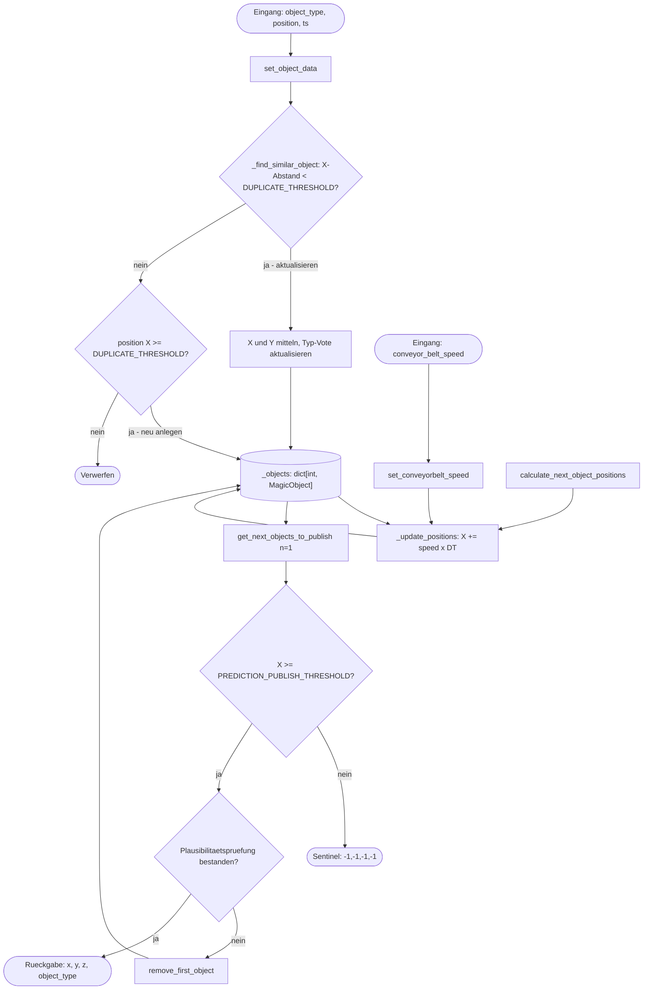

# PositionPrediction 

## Klasse `PositionPrediction`

Erbt von `PositionPredictionInterface`.

Verwaltet von der Kamera erkannte Objekte welche auf dem Förderband l, aktualisiert deren Positionen zeitschrittweise und liefert Vorhersagen für den nächsten Pick-Zyklus an die Main State-Machine.

**Interne Datenstrukturen:**

| Attribut | Typ | Beschreibung |
|---|---|---|
| `_objects` | `dict[int, MagicObject]` | Alle aktiven Objekte, indexiert nach ID |
| `_over_threshold_objects` | `list[MagicObject]` | Objekte, die `X_THRESHOLD` überschritten haben |
| `_object_id_counter` | `int` | Monoton steigender ID-Zähler |
| `_object_type_votes` | `dict[int, Counter]` | Typvoting pro Objekt-ID |
| `_conveyor_belt_speed` | `float` | Aktuelle Förderbandgeschwindigkeit |

---

## Öffentliche Methoden

### `set_conveyorbelt_speed(conveyor_belt_speed: float) -> None`

Setzt die aktuelle Förderbandgeschwindigkeit.

| Parameter | Typ | Beschreibung |
|---|---|---|
| `conveyor_belt_speed` | `float` | Geschwindigkeit in m/s |

**Rückgabe:** `None`

---

### `set_object_data(object_type: int, position: list[float], ts: int) -> None`

Nimmt ein neu erkanntes Objekt entgegen und speichert es.

Existiert bereits ein Objekt innerhalb von `DUPLICATE_THRESHOLD` (X-Achse), wird kein neues Objekt angelegt. Stattdessen werden X und Y gemittelt und der `object_type` per Voting aktualisiert. Der häufigste `object_type` über alle bisherigen Aufrufe wird als finaler Typ gespeichert.

| Parameter | Typ | Beschreibung |
|---|---|---|
| `object_type` | `int` | Erkannter Objekttyp (`0` = Unicorn, `1` = Cat) |
| `position` | `list[float]` | Position `[x, y, z]` im Weltkoordinatensystem |
| `ts` | `int` | Zeitstempel der Erkennung |

**Rückgabe:** `None`

---

### `get_next_objects_to_publish(n: int = 2) -> list[MagicObject]`

Gibt die `n` Objekte mit der größten X-Position zurück, die `PREDICTION_PUBLISH_THRESHOLD` überschreiten.

Objekte, die die Plausibilitätsprüfung nicht bestehen, werden intern entfernt.

| Parameter | Typ | Beschreibung |
|---|---|---|
| `n` | `int` | Anzahl zurückzugebender Objekte (Standard: `2`) |

**Rückgabe:** `list[MagicObject]` – sortiert nach X-Position absteigend

**Fehler:** `ValueError` – wenn keine Objekte vorhanden sind

---

### `get_next_object_to_publish() -> MagicObject`

Gibt das einzelne Objekt mit der größten X-Position zurück.

Sentinel-Objekte werden direkt zurückgegeben. Alle anderen Objekte durchlaufen die Plausibilitätsprüfung.

**Rückgabe:** `MagicObject` – führendes Objekt, oder Sentinel-Liste `[-1.0, -1.0, -1.0, -1]` wenn keine Objekte vorhanden

**Fehler:** `ValueError` – wenn die Plausibilitätsprüfung fehlschlägt

---

### `remove_first_object() -> None`

Entfernt das Objekt mit der größten X-Position aus dem internen Speicher.
Wird gerufen wenn das Objekt von der main abgelehnt wird.

**Rückgabe:** `None`

---

### `calculate_next_object_positions() -> list[tuple[float, float, float, int]]`

Aktualisiert alle Objektpositionen um einen Zeitschritt und gibt die Vorhersage für das führende Objekt zurück.

Reihenfolge intern:
1. Positionsaktualisierung via `_update_positions()`
2. Kandidatenauswahl via `get_next_objects_to_publish(n=1)`

| Rückgabewert | Typ | Beschreibung |
|---|---|---|
| Ergebnis | `list[tuple[float, float, float, int]]` | Liste mit `(x, y, z, object_type)` |

Wenn keine Objekte vorhanden oder keine Kandidaten verfügbar: Rückgabe `[[-1.0, -1.0, -1.0, -1]]`

**Fehler:** `ValueError` – wenn `_conveyor_belt_speed` nicht gesetzt oder negativ

---

## Properties

### `get_stored_objects -> list[MagicObject]`

Gibt alle aktuell gespeicherten Objekte zurück.

**Rückgabe:** `list[MagicObject]`

---

### `get_over_threshold_objects -> list[MagicObject]`

Gibt alle Objekte zurück, die `X_THRESHOLD` überschritten haben und entfernt wurden.

**Rückgabe:** `list[MagicObject]`

---

### `get_conveyor_belt_speed -> float`

Gibt die aktuell gesetzte Förderbandgeschwindigkeit zurück.

**Rückgabe:** `float`

---

## Datenfluss 

