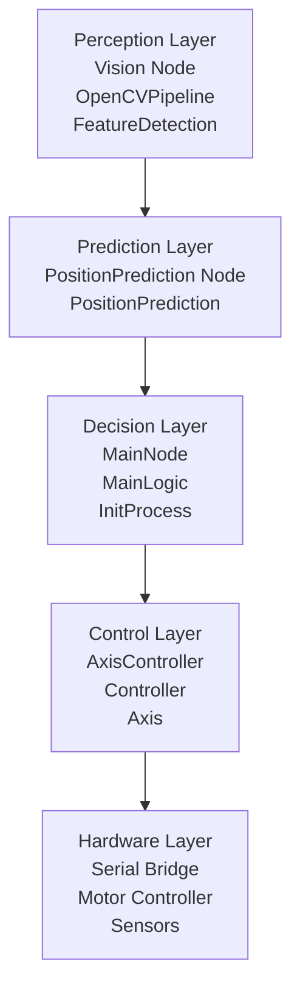
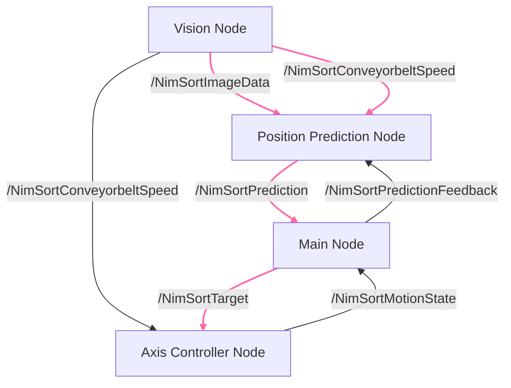

<!-- Written, maintained and owned by Louis Moser, Linus Braun, Yannick Bachhuber (NIMSORT42 DEVELOPMENT TEAM) -->

# NIMSORT42 Projekt - Dokumentations-Grundgerüst

**Projektversion**: 1.0.1  
**Datum**: 11.06.2026
**Status**: Projektabschluss
**Status-d-Doc**: In Dev

---

## Inhaltsverzeichnis

1. [Projektplan](#1-projektplan)
2. [Software-Architektur](#2-software-architektur)
3. [Designentscheidungen](#3-designentscheidungen)
4. [Technische Herleitungen](#4-technische-herleitungen)
5. [Lessons Learned](#5-Lessons-Learned)
6. [Documente und Referenzen](#6-Dokumente-und-Referenzen)

---

## Zugehörige Projektdokumentationen

[logic_2.md](logic_2)  
[ros.md](ros.md)  

---

# 1 Projektplan

## 1.1 Projektübersicht

### 1.1.1 Ziele
- Entwicklung einer Sortieranlage basierend auf einem Portalroboter und einem Kamerasystem. 
- Unabhängige Entwicklung der Pyhton logik mit klaren und leichtgewichtigen Schnittstellen
- Entwickeln eines Prototypen mit der Middleware ROS2 Humble für ein gesamtsystem

### 1.1.2 Projektumfang
- **Kernkomponenten**: Logik In Python organisiert in Modulen in einem Python Package
- **Vision-Systeme**: Bild-Verarbeitung, Homographie, Machine Learning
- **ROS2-Integration**: ROS2 Nodes für Datenasutausch und übergeordnete Software Architektur
- **Dokumentation**: Design-Spezifikationen, Deployment-Guides

### 1.1.3 Stakeholder
- Entwicklungsteam 
    - Yannick Bachhuber
    - Keppler Benjamin
    - Moser Louis

- Auftraggeber
    - Prof. Dr. Mathias Lorenzen
    - Haribo (Auftraggebendes Unternehmen)

### 1.1.4 Risiken 
- Hardware versagt oder wird nicht früh genug bereit gestellt-> Zeitplan geht nicht auf
- Team Mitglied fällt aus -> Zeitplan geht nicht auf
- Professor fällt aus -> Projekt nicht bewertbar
- Zu geringe Hardwareverfügbarkeit -> zu wenig praktisches testen möglich

### 1.1.5
- Iterativ
- Wasserfall in den Iterationen

---

## 1.2 Meilensteine und Zeitplan

### Meilenstein: Notwendige Koordinatensysteme festgelegt ( 30.03.2026 ) ✅
| Project-Flow | Termin | Status | Beschreibung |
|------------|--------|--------|------------|
| PF1.1 | 23.03.2026 | ✅ |  • Die Notwendigen Koordinatensysteme für das Robotik Projekt 3 sind klassifiziert und festgelegt.<br>• Die Entscheidungen sind begründet Dokumentiert<br>• Ein Projektplan mit Meilensteinen wurde erstellt |
| PF1.2 | 30.03.2026 | ✅ |  • Die Kickoff Präsentation ist gehalten<br>• Eine vorläufige akzeptierte Softwarearchitektur ist erstellt |

### Meilenstein: Grundlagen realisieren ( 13.04.2026 ) ✅
| Project-Flow | Termin | Status | Beschreibung |
|------------|--------|--------|------------|
| PF2.1 | 06.04.2026 | ✅ |  • Eine Kommunikation mit der Hardware kann hergestellt werden<br>• die msg Informationen der Hardware Schnittstelle können empfangen und gesendet werden<br>• Kamerabild kann gemacht werden |
| PF2.2 | 13.04.2026 | ✅ |  • Kamerakoordinatensystem (Kameraausrichtung) ist festgelegt.<br>• Bild Pipeline bis Kantendetektion der Objekte ist Programmiert.<br>• Ros Konten inkl. Sub/Pub ist programmiert und getestet. |

### Meilenstein: Prädizierte Positionen im Weltkoordiantensystem Ausgeben ( 27.04.2026 ) ✅
| Project-Flow | Termin | Status | Beschreibung |
|------------|--------|--------|------------|
| PF3.1 | 20.04.2026 | ✅ |  • Berechnung / Bestimmung durch Koordinatentransformation von allen Koordinatensystemen ins Weltkooridnatensystem<br>• Weitergabe der koordinaten bis zur main node und anschließende konstante ausgabe der Prädizierten Koordinaten eines Objekts. |
| PF3.2 | 27.04.2026 | ✅ |  • Die gesamte Anlage hat eine funktionierende initiale Kalibrierung der Achsen. |

### Meilenstein: Regelung auf einen Punkt im Weltkoordinatensystem ( 25.05.2026 ) ✅
| Project-Flow | Termin | Status | Beschreibung |
|------------|--------|--------|------------|
| PF4.1 | 11.05.2026 | ✅ |  • Die Regelung auf einen Punkt im Koordinatensystem ist Programmiert.<br>• Achsen können auf einen kommandierten Punkt fahren<br>• Anwendungsspezifische Punkte sind festgelegt. |
| PF4.2 | 25.05.2026 | ✅ |  • Feature / Shape Matching ist programmiert.<br>• Klassifikation der Form funktioniert zuverlässig.<br>• Greifprozess ist programmiert und getestet |

### Meilenstein: Prozesslogik ist in Python Programmiert und getestet ( 01.06.2026 ) ✅
| Project-Flow | Termin | Status | Beschreibung |
|------------|--------|--------|------------|
| PF5.1 | 01.06.2026 | ✅ |  • alle daten aus Kamera pipeline, Sensorlogik u.a. werden in einer statemachine der Prozesslogik zusammengefasst. |

### Meilenstein: Abschlusspräsentationen ( 01.06.2026 ) ✅
| Project-Flow | Termin | Status | Beschreibung |
|------------|--------|--------|------------|
| PF6.1 | 22.06.2026 | ✅ |  • Alle Software tests sind geschrieben<br>• Praktische Tests sind ausreichend durchgeführt<br>• Dokumentation ist vollständig |
| PF6.2 | 29.06.2026 | ✅ |  • Beide Abschließenden Präsentationen sind gehalten. |

1. Puffer **(01.06 bis 15.06)**
2. Puffer **(30.06 bis 13.07)**

---

**Legende:**
- ✅ Abgeschlossen (100%)
- ⚠️ In Arbeit mit Verzögerung
- ⏳ Geplant/In Bearbeitung
- 🎯 Kritischer Meilenstein (Deadline)

---

# 2 Software-Architektur

## 2.1 Architektur-Übersicht


### 2.1.1 Ebenenmodell 
Die Softwarearchitektur folgt einer geschichteten, ereignisgesteuerten Architektur. Wahrnehmung (Perception), Positionsvorhersage (Prediction), Entscheidungsfindung (Decision Making) und Hardwaresteuerung sind auf dedizierte ROS2-Nodes verteilt. Die Abhängigkeiten zwischen den Nodes sind strikt unidirektional, wodurch eine hierarchische Verarbeitungspipeline entsteht. Die funktionale Sicherheit wird durch eine Fail-Stop-Strategie mit Heartbeat-basierter Überwachung von Abhängigkeiten realisiert. Wird eine kritische Abhängigkeit nicht mehr bereitgestellt, wechselt der betroffene Node in einen Fehlerzustand und beendet seine Ausführung. Der AxisController stellt die einzige sicherheitskritische Komponente des Systems dar und führt vor dem Herunterfahren eine vordefinierte Referenzierungs- bzw. Homing-Sequenz aus.



### 2.1.2 Python Package Aufbau
```
nimsort_logic/
├── conigs/*.py                         # Konfigurationsdateien
├── nimsort_feature_detection/*.py      # Featuredetection Scripts
├── nimsort_main/*.py                   # Main-logic
├── nimsort_motion/*.py                 # Axis-Scripts, Regler usw.
├── nimsort_vision/*.py                 # Vision und Positionprediction scripts
└── setup.py                            # Package description

```
Jeder Unterordner enthält semantisch logisch seine Pyhton Dateien  zur Realisierung der später aufgeführten Anforderungen an die entsrechenden Module.

Jede Haupt-logikdatei Implementiert ein im selben ordner Definierte Schnitstelle, diese definiert die Minimale Implementierung an Methoden welche zur vollständigen Verwendungder Logik notwendigen Methoden.

## 2.2 Komponentenbeschreibung u. Anforderungen d. Logik

### 2.2.1 OpenCVPipeline

**Datei**: `nimsort_logic/nimsort_vision/opencv_pipeline.py`

| Anforderungen | Schnittstellen | Programmart | Rückgaben | Abhängigkeiten |
|------------|--------|--------|--------|------------|

### 2.2.2 FeatureDetection

**Datei**: `nimsort_logic/nimsort_feature_detection/feature_detection.py`

| Anforderungen | Schnittstellen | Programmart | Rückgaben | Abhängigkeiten |
|------------|--------|--------|--------|------------|

### 2.2.3 PositionPrediction

**Datei**: `nimsort_logic/nimsort_vision/position_prediction_logic.py`

| Anforderungen | Schnittstellen | Programmart | Rückgaben | Abhängigkeiten |
|------------|--------|--------|--------|------------|

### 2.2.4 MainLogic

**Datei**: `nimsort_logic/nimsort_main/main_logic.py`

| Anforderungen | Schnittstellen | Programmart | Rückgaben | Abhängigkeiten |
|------------|--------|--------|--------|------------|

### 2.2.5 InitProcess

**Datei**: `nimsort_logic/nimsort_motion/init_process.py`

| Anforderungen | Schnittstellen | Programmart | Rückgaben | Abhängigkeiten |
|------------|--------|--------|--------|------------|

### 2.2.6 Axis

**Datei**: `nimsort_logic/nimsort_motion/software_axis.py`

| Anforderungen | Schnittstellen | Programmart | Rückgaben | Abhängigkeiten |
|------------|--------|--------|--------|------------|

### 2.2.6 Controller

**Datei**: `nimsort_logic/nimsort_motion/software_axis.py`

| Anforderungen | Schnittstellen | Programmart | Rückgaben | Abhängigkeiten |
|------------|--------|--------|--------|------------|

## 2.3 Beschreibung u. Anforderungen d. ROS2 Nodes

### 2.3.1 Vision

| Anforderungen | Schnittstellen | Logik Implementierungen |
|------------|--------|------------|
| • Aufnahme von Bildern<br>• Verarbeitet das Bild bis zu Pickpoint und vorverarbeitetem Graustufenbild<br>• Erkennt um welches Objekt es sich handelt<br>• Berechnet die Förderbandgeschwindigkeit | NimSortImageData, NimSortConveyorbeltSpeed | • OpencvPipeline<br>• ConveyorSpeedEstimator<br>• FeatureDetection |

### 2.3.2 PositionPrediction

| Anforderungen | Schnittstellen | Logik Implementierungen |
|------------|--------|--------------------|
| • Speichern der erkannten Objekte<br>• Berechnung der neuen Positionen mit evtl. ber"ucksichtigung neuer erkantner Daten<br>• Aktualisierung der erkannten Objekte | NimSortPrediction, NimSortImageData, NimSortConveyorbeltSpeed | • PositionPrediction |

### 2.3.3 Main

| Anforderungen | Schnittstellen | Logik Implementierungen |
|------------|--------|------------|
|  • Orchestriere und verwalte den Programmfluss <br>• Rufe Systeminitialisierung auf | NimSortMotionState, NimSortPrediction, NimSortConveyorbeltSpeed  | • Main |

### 2.3.4 AxisController

| Anforderungen | Schnittstellen | Logik Implementierungen |
|------------|--------|------------|
| • Erhalte: RobotPos<br>• Halte und verwalte die Axen<br>• Kenne und vermeide verbotene fahrzonen<br>• Publish RobotCmd | NimSortTarget, RobotPos, NimSortMotionState, RobotCmd| • InitProcess<br>• Axis |

## 2.4 Datenfluss und Timing

### 2.4.1 Haupttakt der ROS2 Nodes
Alle ROS2 Nodes sind aktiv Timer gesteuert. Diese timer sind alel auf 10Hz Konfiguriert dementsprechend werden alle Topics im 10Hz takt erwartet und auch gepublished.

### 2.4.2 Datenfluss
Allgemein wurde eine Architektur erstellt in welcher die Datenflüsse hauptsächlich eine Richtung kennen. 
Gelegentlich ist zwar ein feedback notwendig diese ist aber nicht zwangsweise notwendig für die Node. Folgendes Diagramm zeigt die unbedingt notwendigen Datenflüsse im Takt der ROS2 Node pink dargestellt. Die nicht notwendigen Schwarz dargestellt.



# 3 Designentscheidungen

## 3.1 State Machines
**Entscheidung:** Verwendung von einer State Machine ausschließlich in der Main Logic

**Begründung:**
- Vorhersagbares Verhalten
- Einfaches debugging
- Einfach Erweiterbar

## 3.2 PD-Regler vs. PDF-Regler
**Entscheidung:** Finale Entscheidung hin zu einem PD Regler, auch wenn die Software schnell auf PDF erweitert werden könnte.

**Begründung:**
- Systematischer fehler auf der X- und Y-Achse müsste dabei in der Software berücksichtigt werden.
- Verhältnissmäßig Großer overhead zum wechseln eines schnell aufgelegten PD-Regler zu einem gut ausgelegten PDF-Regler
- Gut genuges Ergebniss mit PD-Regler

## 3.3 Keine Aruco Marker sondern Homographie
**Entscheidung:** Keine Verwendung von Aruco Markern. Ersatz durch eine Homographie durch vorhandene erkennbare Bildpunkte.

**Begründung:**

## 3.4 Decision Tree
**Entscheidung:** Verwendung eines Entscheidungsbaumes als Machine Learning Modell zur differenzierung von den drei Klassen, Einhorn, Katze und Rest

**Begründung:**

## 3.5 Sentinels
**Entscheidung:** Definieren von Sentinels zum Publishen von nicht-Fehler werten, aber leeren Werten

**Begründung:**
- Das konsatate berichten der Daten ist wichtig für das angewendete Konzept des Fail-Safe
- Eindeutiges Logging und frühere Abbruchbedingungen
- Vermeiden von versehentlich leeren Werten.
- Einfachere Testbarkeit

## 3.6 Fail-Safe statt Fail-Operational
**Entscheidung:** Kein Faile-Operational, sondern ein Fail safe mit definiertem Safe-State

**Begründung:**
- Einfacher mit unseren anderen Entscheidungen umzusetzen
- Sicherer Zustand der Maschine sorgt für Sicherheit für Mensch und Maschine, weil so sowohl Software als auch Hardware fehler zu großen Teilen erkannt werden können und zu einem Sicheren Zustand führen können.
- Wenn die Software fehl schlägt muss aus Sicherheitsgründen für die Maschine die Software sowieso neugestartet werden -> Ein fail-Operational müsste sowieso ein Softwareneustart folgen
- Einfacheres Debug durch absichtliches versetzen in den Safe-State
**Files:** Für mehr Informationen über das Fail save konzept lesen sie hier: [failsave_concept.md](../docs/sw_planning/failsafe_concept.md)

## 3.7 Koordinatensysteme
**Entscheidung:** Lage und Definiton der Koordinatensysteme

**Begründung:**
- Die Frühe Definition hilft in der Kommunikation im Team und trägt zum gemeinsamen verständniss des Systems bei.
**Files:** Für mehr information zu den verwendeten Koordinatensystemen lesen sie hier: [CSSystem.md](../docs/sw_planning/CSSystem.md)

## 3.8 Kamera-Ausrichtung mit digitalem Overlay
**Entscheidung:** Kamera-Ausrichtung mit einem Digitalen Overlay 

**Begründung:**
- Genaue Ausrichtung der Kamera führt zu besseren Positionsdaten in der Software.
- Durch die Nutzung der Homograophie mit festen Bildpunkten der Anwendung muss die Kamera relativ genau immer gleich stehen.
- durch regelmäßigere Kontroller kann wenigstens dieser Hardware Fehler größtenteils ausgeschlossen werden.

**Files:** Dieses Skript zeigt ein digitales Overlay über dem Live-Kamerabild und dient dazu,
die Kamera reproduzierbar auf eine definierte Position auszurichten.


## 3.9 Datenhaltung in der PositionPrediction
**Entscheidung:**

**Begründung:**

# 4 Technische Herleitungen

## 4.1 Conveyorbeld Speed Berechnung und Haltung

## 4.2 Homographie

## 4.3 Position Prediction Datenhaltung

## 4.4 PD-Regler

## 4.5

# 5 Lessons Learned

## 5.1 Wichtigkeit des Anforderungs Engineerings
Die Qualität der Anforderungen kann sich auf viele bereiche der Software auswirken.
- Schwere Fehler beeinträchtigen die Qualität der Architektur
- Kleienere Fehler beeinträchtigen bestenfalls nur Module oder Codeintegrität

## 5.2 Kooridnatensysteme
Spätes angehen der korrekten Koordinaten und Transformationen führt zu mehrfachen anläufen in der korrekten Funktionalität

## 5.3 Runntime Plausibilitätschekcs
- Plausibilitätschecks an Schnittstellen oder übergabestellen testet schon früh und imemr zur laufzeit ob funktionen Sinnvolle Werte zurückgeben und ob datensätze verarbeitet werden sollten.
- In diesem Fall sicherte das die Hardware indem viele Fehlerhafte Koordinaten vor der Übergabe an die Achsen mehrfach auf ihren Sinnhaftigkeit geprüft wurden.

## 5.4 Fehlerhafte Hardware kostet Software viel Zeit
- Nicht jeder Hardwarefehler kann sofort als solcher erkannt werden. Die Folge ist das Suchen von Fehlern die es nicht gibt
- Fehlerhafte Hardware kann dazu führen, dass diese sich selbst beschädigt, ohne, dass das mit Software abgesichert werden kann
- Beschädigte Hardware kostet den Entwickler der das Problem selbst beheben muss viele Stunden Arbeit, weil es nicht sein Fachgebiet ist.
- Absichtlich billige Hardware muss durch übertriebene Softwarerobustheit ausgeglichen werden, da mangeld gute Hardware einfache Konzepte durch konsistent neue Fehler einfache Konzepte zunichte macht
Für Informationen über die an der Hardware durch NIMSORT42 dev's vorgenommenen Änderungen an der Hardware hier: [hardware_fixes.md](../docs/hardware_fixes.md)
 
## 5.5 Belichtung
- Konsistente Belichtung ist neben der korekten Ausrichtung der wichtigste Schlüssel für Konsistet korrekte erkennung aller objekte und deren Daten.

## 5.6 Interface Segregation
Das Prinzip I von SOLID hilft viel
- Bei der Verteilung von Daten können kleinere Datensätze durch Interface Segregation schneller an andere Module gegeben werden ohne unnötige abhängigkeiten zu erzuegen
- Durch kleinere Schnitstellen werden Plausibilitätschecks und Datenhaltung einfacher.

## 5.7 Einheutliche Konzepte
- Logging Conventions hat das debuggen einfacher gemacht weil fehler oder nicht reviewter Code sich durch nicht angepasst Logs zu erkennen gegeben hat
- Logging Conventions hat logs schneller zum Code zugeordnet
- Interfaces haben das fehlen von Funktionen noch vor Programmstart klar gemacht
- Das einheitliche Verständniss der Anforderungen und die Einordnung im Gesamtsystem haben in der Teamdynamik dazu geführt, dass jeder zu jedem Themenbereich Vorschläge einbringen konnte und haben das generelle Systemverständnis früh auf den selben stand gebracht. -> Missverständnisse konnten reduziert bzw. vermieden werden.
Siehe auch: [architecture_decisions.md](../docs/sw_planning/architecture-decision.md) [interface.md](../docs/sw_planning/interface.md) [logging.md](../docs/sw_planning/logging.md)


# 6 Documente und Referenzen

## 6.1 Code Nutzung und Dokumentation

Dokumentation des Logik Packages und seinen Modulen im Detail:
[nimsort_logic.md](nimsort_logic.md)
Dokumentationd er Beispielimplementierung des Logik Packages mit ROS2 Humble:
[nimsort_ros.md](nimsort_ros.md)
Projektplanung:
README des Repos:
[README.md](../README.md)
