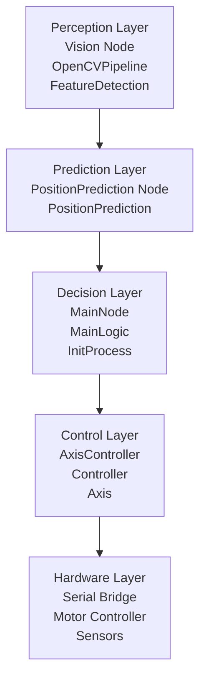
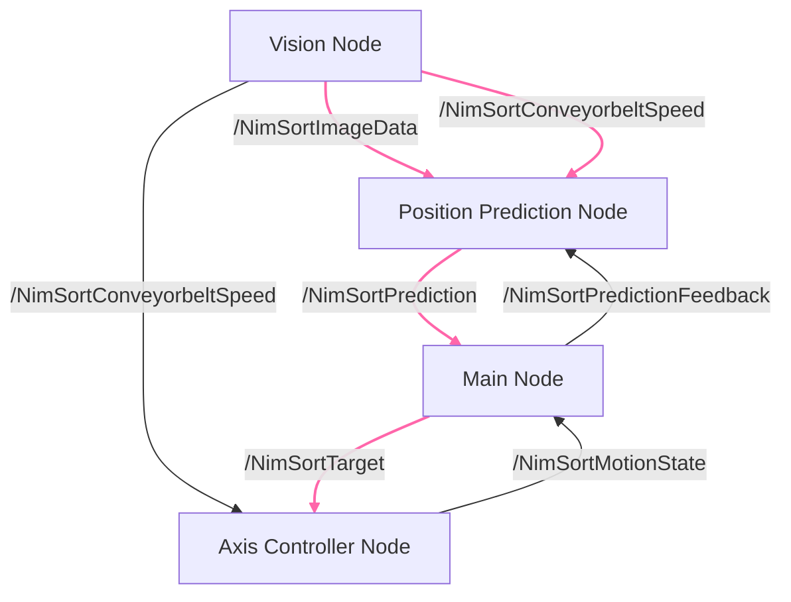
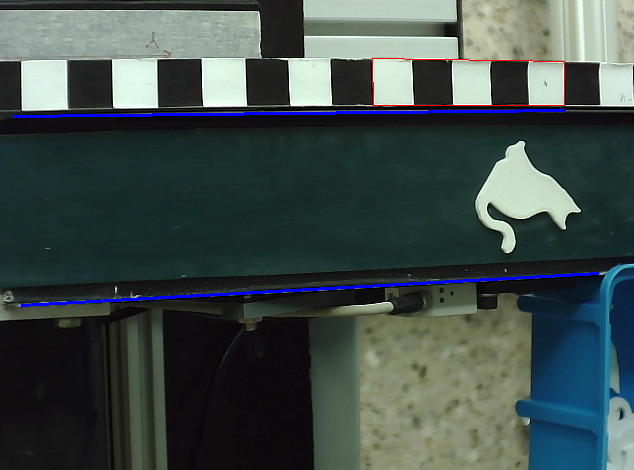
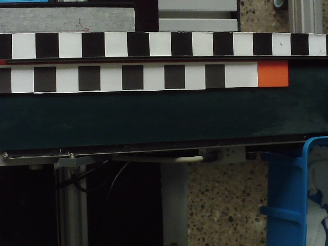
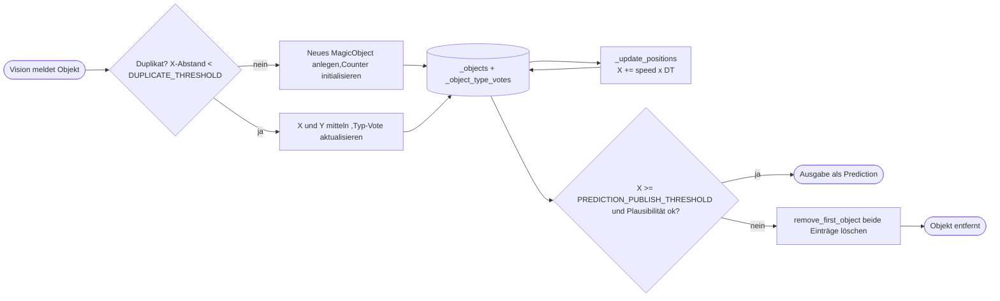
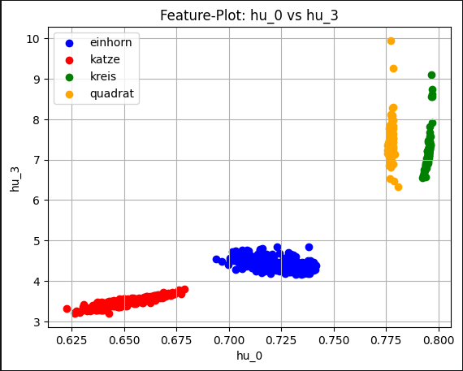

<!-- Written, maintained and owned by Louis Moser, Benjamin Keppler, Yannick Bachhuber (NIMSORT42 DEVELOPMENT TEAM) -->

# NIMSORT42 Projekt - Dokumentations-Grundgerüst

**Projektversion**: 1.0.1    
**Datum**: 11.06.2026  
**Status**: Projektabschluss  
**Status-d-Doc**: In Development  

---

## Inhaltsverzeichnis

1. [Projektplan](#1-projektplan)
2. [Software-Architektur](#2-software-architektur)
3. [Designentscheidungen](#3-designentscheidungen)
4. [Technische Herleitungen](#4-technische-herleitungen)
5. [Lessons Learned](#5-lessons-learned)
6. [Auswertung des Gesamtsystems](#6-auswertung-des-gesamtsystems)
7. [Dokumente und Referenzen](#7-dokumente-und-referenzen)

---

## Zugehörige Projekt-Codedokumentationen
Dokumentation der Umsetzung der Anforderungen und der Limitierungen der Logik: **[nimsort_logic.md](nimsort_logic.md)**  
Dokumentation der beispielhaften Implementierung mit ROS2: **[nimsort_ros.md](nimsort_ros.md)**  

---

# 1 Projektplan

## 1.1 Projektübersicht

### 1.1.1 Ziele
- Entwicklung einer Sortieranlage basierend auf einem Portalroboter und einem Kamerasystem. 
- Unabhängige Entwicklung der Python-Logik mit klaren und leichtgewichtigen Schnittstellen
- Entwicklung eines Prototypen mit der Middleware ROS2 Humble für ein Gesamtsystem

### 1.1.2 Projektumfang
- **Kernkomponenten**: Logik In Python organisiert in Modulen in einem Python Package
- **Vision-Systeme**: Bildverarbeitung, Homographie, Machine Learning
- **ROS2-Integration**: ROS2 Nodes für Datenaustausch und übergeordnete Softwarearchitektur
- **Dokumentation**: Design-Spezifikationen, Deployment-Guides

### 1.1.3 Stakeholder
- Entwicklungsteam 
    - Yannick Bachhuber
    - Keppler Benjamin
    - Moser Louis

- Auftraggeber
    - Prof. Dr. Mathias Lorenzen
    - Haribo (Auftraggebendes Unternehmen)

### 1.1.4 Risiken 
- Hardware versagt oder wird nicht früh genug bereit gestellt-> Zeitplan geht nicht auf
- Team Mitglied fällt aus -> Zeitplan geht nicht auf
- Professor fällt aus -> Projekt nicht bewertbar
- Zu geringe Hardwareverfügbarkeit -> zu wenig praktisches testen möglich

### 1.1.5 Arbeitsweise
- Iterativ
- Wasserfall in den Iterationen

---

## 1.2 Meilensteine und Zeitplan

### Meilenstein: Notwendige Koordinatensysteme festgelegt ( 30.03.2026 ) ✅
| Project-Flow | Termin | Status | Beschreibung |
|------------|--------|--------|------------|
| PF1.1 | 23.03.2026 | ✅ |  • Die Notwendigen Koordinatensysteme für das Robotik Projekt 3 sind klassifiziert und festgelegt.<br>• Die Entscheidungen sind begründet Dokumentiert<br>• Ein Projektplan mit Meilensteinen wurde erstellt |
| PF1.2 | 30.03.2026 | ✅ |  • Die Kickoff Präsentation ist gehalten<br>• Eine vorläufige akzeptierte Softwarearchitektur ist erstellt |

### Meilenstein: Grundlagen realisieren ( 13.04.2026 ) ✅
| Project-Flow | Termin | Status | Beschreibung |
|------------|--------|--------|------------|
| PF2.1 | 06.04.2026 | ✅ |  • Eine Kommunikation mit der Hardware kann hergestellt werden<br>• die msg Informationen der Hardware Schnittstelle können empfangen und gesendet werden<br>• Kamerabild kann gemacht werden |
| PF2.2 | 13.04.2026 | ✅ |  • Kamerakoordinatensystem (Kameraausrichtung) festgelegt.<br>• Bildpipeline bis Kantendetektion implementiert.<br>• ROS-Nodes (incl. Publisher/Subscriber) implementiert und getestet. |

### Meilenstein: Prädizierte Positionen im Weltkoordiantensystem Ausgeben ( 27.04.2026 ) ✅
| Project-Flow | Termin | Status | Beschreibung |
|------------|--------|--------|------------|
| PF3.1 | 20.04.2026 | ✅ |  • Berechnung / Bestimmung durch Koordinatentransformation zwischen Bezugssystemen ins Weltkoordinatensystem<br>• Weitergabe der Koordinaten zur Main-Node und kontinuierliche Ausgabe der vorhergesagten Koordinaten. |
| PF3.2 | 27.04.2026 | ✅ |  • Die gesamte Anlage hat eine funktionierende initiale Kalibrierung der Achsen. |

### Meilenstein: Regelung auf einen Punkt im Weltkoordinatensystem ( 25.05.2026 ) ✅
| Project-Flow | Termin | Status | Beschreibung |
|------------|--------|--------|------------|
| PF4.1 | 11.05.2026 | ✅ |  • Die Regelung auf einen Punkt im Koordinatensystem ist Programmiert.<br>• Achsen können auf einen kommandierten Punkt fahren<br>• Anwendungsspezifische Punkte sind festgelegt. |
| PF4.2 | 25.05.2026 | ✅ |  • Feature / Shape Matching ist programmiert.<br>• Klassifikation der Form funktioniert zuverlässig.<br>• Greifprozess ist programmiert und getestet |

### Meilenstein: Prozesslogik ist in Python Programmiert und getestet ( 01.06.2026 ) ✅
| Project-Flow | Termin | Status | Beschreibung |
|------------|--------|--------|------------|
| PF5.1 | 01.06.2026 | ✅ |  • alle daten aus Kamera pipeline, Sensorlogik u.a. werden in einer statemachine der Prozesslogik zusammengefasst. |

### Meilenstein: Abschlusspräsentationen ( 01.06.2026 ) ✅
| Project-Flow | Termin | Status | Beschreibung |
|------------|--------|--------|------------|
| PF6.1 | 22.06.2026 | ✅ |  • Alle Software tests sind geschrieben<br>• Praktische Tests sind ausreichend durchgeführt<br>• Dokumentation ist vollständig |
| PF6.2 | 29.06.2026 | ✅ |  • Beide Abschließenden Präsentationen sind gehalten. |

1. Puffer **(01.06 bis 15.06)**
2. Puffer **(30.06 bis 13.07)**

---

**Legende:**
- ✅ Abgeschlossen (100%)
- ⚠️ In Arbeit mit Verzögerung
- ⏳ Geplant/In Bearbeitung
- 🎯 Kritischer Meilenstein (Deadline)

---
## 1.3 Interne Dokumentation
Um die Projektinterne Dokumentation für das Projektmanagement zu sehen, schauen sie hier: [projektplanung.md](../docs/management/projektplanung.md)

# 2 Software-Architektur

## 2.1 Architektur-Übersicht


### 2.1.1 Ebenenmodell 
Die Softwarearchitektur folgt einer geschichteten, ereignisgesteuerten Architektur. Wahrnehmung (Perception), Positionsvorhersage (Prediction), Entscheidungsfindung (Decision Making) und Hardwaresteuerung sind auf dedizierte ROS2-Nodes verteilt. Die Abhängigkeiten zwischen den Nodes sind strikt unidirektional, wodurch eine hierarchische Verarbeitungspipeline entsteht. Die funktionale Sicherheit wird durch eine Fail-Stop-Strategie mit Heartbeat-basierter Überwachung von Abhängigkeiten realisiert. Wird eine kritische Abhängigkeit nicht mehr bereitgestellt, wechselt der betroffene Node in einen Fehlerzustand und beendet seine Ausführung. Der AxisController stellt die einzige sicherheitskritische Komponente des Systems dar und führt vor dem Herunterfahren eine vordefinierte Referenzierungs- bzw. Homing-Sequenz aus.


```mermaid
flowchart TD

    P["Perception Layer<br/>Vision Node<br/>OpenCVPipeline<br/>FeatureDetection"]

    PR["Prediction Layer<br/>PositionPrediction Node<br/>PositionPrediction"]

    D["Decision Layer<br/>MainNode<br/>MainLogic<br/>InitProcess"]

    C["Control Layer<br/>AxisController<br/>Controller<br/>Axis"]

    H["Hardware Layer<br/>Serial Bridge<br/>Motor Controller<br/>Sensors"]

    P --> PR
    PR --> D
    D --> C
    C --> H
```

### 2.1.2 Python Package Aufbau
```
nimsort_logic/
├── configs/*.py                        # Konfigurationsdateien
├── nimsort_feature_detection/*.py      # Featuredetection Scripts
├── nimsort_main/*.py                   # Main-logic
├── nimsort_motion/*.py                 # Axis-Scripts, Regler usw.
├── nimsort_vision/*.py                 # Vision und Positionprediction scripts
└── setup.py                            # Package description

```
Jeder Unterordner enthält semantisch logisch seine Pyhton Dateien  zur Realisierung der später aufgeführten Anforderungen an die entsrechenden Module.

Jede Haupt-logikdatei Implementiert ein im selben ordner Definierte Schnitstelle, diese definiert die Minimale Implementierung an Methoden welche zur vollständigen Verwendungder Logik notwendigen Methoden.

## 2.2 Beschreibung u. Anforderungen d. ROS2 Nodes

### 2.2.1 Vision

| Anforderungen | Schnittstellen | Logik Implementierungen |
|------------|--------|------------|
| • Aufnahme von Bildern<br>• Verarbeitet das Bild bis zu Pickpoint und vorverarbeitetem Graustufenbild<br>• Erkennt um welches Objekt es sich handelt<br>• Berechnet die Förderbandgeschwindigkeit | <br>NimSortImageData<br> NimSortConveyorbeltSpeed | • OpencvPipeline<br>• FeatureDetection<br>• ConveyorSpeedEstimator  |

### 2.2.2 PositionPrediction

| Anforderungen | Schnittstellen | Logik Implementierungen |
|------------|--------|--------------------|
| • Speichern der erkannten Objekte<br>• Berechnung der neuen Positionen mit evtl. berücksichtigung neuer erkantner Daten<br>• Aktualisierung der erkannten Objekte | NimSortPrediction <br> NimSortImageData <br> NimSortConveyorbeltSpeed | • PositionPrediction |

### 2.2.3 Main

| Anforderungen | Schnittstellen | Logik Implementierungen |
|------------|--------|------------|
|  • Orchestriere und verwalte den Programmfluss <br>• Rufe Systeminitialisierung auf | NimSortMotionState<br> NimSortPrediction<br> NimSortConveyorbeltSpeed  | • Main |

### 2.2.4 AxisController

| Anforderungen | Schnittstellen | Logik Implementierungen |
|------------|--------|------------|
| • Erhalte: RobotPos<br>• Halte und verwalte die Axen<br>• Kenne und vermeide verbotene fahrzonen<br>• Publish RobotCmd | NimSortTarget<br> RobotPos<br> NimSortMotionState<br> RobotCmd| • InitProcess<br>• Axis |

## 2.3 Datenfluss und Timing

### 2.3.1 Haupttakt der ROS2 Nodes
Alle ROS2 Nodes sind aktiv Timer gesteuert. Diese timer sind alle auf 10Hz Konfiguriert dementsprechend werden alle Topics im 10Hz takt erwartet und auch gepublished.

### 2.3.2 Datenfluss
Allgemein wurde eine Architektur erstellt in welcher die Datenflüsse hauptsächlich eine Richtung kennen. 
Gelegentlich ist zwar ein feedback notwendig diese ist aber nicht zwangsweise notwendig für die Node. Folgendes Diagramm zeigt die unbedingt notwendigen Datenflüsse im Takt der ROS2 Node pink dargestellt. Die nicht notwendigen Schwarz dargestellt.


```mermaid
flowchart TD

    VISION["Vision Node"]
    POSP["Position Prediction Node"]
    MAIN["Main Node"]
    AX["Axis Controller Node"]

    VISION -->|/NimSortImageData| POSP
    VISION -->|/NimSortConveyorbeltSpeed| POSP
    VISION -->|/NimSortConveyorbeltSpeed| AX

    POSP -->|/NimSortPrediction| MAIN

    MAIN -->|/NimSortPredictionFeedback| POSP
    MAIN -->|/NimSortTarget|AX
    
    AX -->|/NimSortMotionState|MAIN
    
    linkStyle 0 stroke:#ff66aa,stroke-width:2px
    linkStyle 1 stroke:#ff66aa,stroke-width:2px
    linkStyle 3 stroke:#ff66aa,stroke-width:2px
    linkStyle 5 stroke:#ff66aa,stroke-width:2px
```

## 2.4 Veratwortlichkeitsbereiche
- **Louis Moser:** Vision, Machine-Learning
- **Yannick Bachhuber:** PositionPrediction, Main
- **Benjamin Keppler:** AxisController, Main

# 3 Designentscheidungen

## 3.1 State Machines
**Entscheidung:** Verwendung von einer State Machine in der Main Logic

**Begründung:**
- Vorhersagbares Verhalten
- Einfaches debugging
- Einfach Erweiterbar

## 3.2 PD-Regler vs. PDF-Regler
**Entscheidung:** Finale Entscheidung hin zu einem PD Regler, auch wenn die Software schnell auf PDF erweitert werden könnte.

**Begründung:**
- Systematischer fehler auf der X- und Y-Achse müsste dabei in der Software berücksichtigt werden.
- Verhältnissmäßig Großer overhead zum wechseln eines schnell aufgelegten PD-Regler zu einem gut ausgelegten PDF-Regler
- Gut genuges Ergebniss mit PD-Regler

## 3.3 Keine Aruco Marker sondern Homographie
**Entscheidung:** Keine Verwendung von Aruco Markern für die Koordinatentransfürmation. Ersatz durch eine Homographie durch vorhandene erkennbare Bildpunkte.

**Begründung:**
- Die Koordinatentransformation (Pixel → Kamera → Welt) über Aruco Marker erwies sich als zu fehleranfällig, da die Positionsschätzung der Marker relativ zur Kamera unter realen Bedingungen unzuverlässig war.
- NimSort arbeitet ausschließlich in 2D, eine vollständige 3D-Transformation ist daher nicht erforderlich.
- Eine Homographie auf Basis vorhandener Bildpunkte ist für diesen Anwendungsfall vollkommen ausreichend und deutlich robuster.

## 3.4 Decision Tree
**Entscheidung:** Verwendung eines Entscheidungsbaumes als Machine Learning Modell zur differenzierung von den drei Klassen, Einhorn, Katze und Rest (Kreis und Quadrat).

**Begründung:**
- Die Klassen sind anhand der verwendeten Merkmale (Hu-Momente) klar voneinander unterscheidbar, wodurch die Entscheidungslogik gut durch binäre Ja/Nein-Verzweigungen abgebildet werden kann.
- Ein Entscheidungsbaum ist für diesen Anwendungsfall ausreichend und bietet den Vorteil, dass die Klassifikationsentscheidungen nachvollziehbar und interpretierbar bleiben.

## 3.5 Sentinels
**Entscheidung:** Definieren von Sentinels zum Publishen von nicht-Fehler werten, aber leeren Werten

**Begründung:**
- Das konsatate berichten der Daten ist wichtig für das angewendete Konzept des Fail-Safe
- Eindeutiges Logging und frühere Abbruchbedingungen
- Vermeiden von versehentlich leeren Werten.
- Einfachere Testbarkeit

## 3.6 Fail-Safe statt Fail-Operational
**Entscheidung:** Kein Faile-Operational, sondern ein Fail safe mit definiertem Safe-State

**Begründung:**
- Einfacher mit unseren anderen Entscheidungen umzusetzen
- Sicherer Zustand der Maschine sorgt für Sicherheit für Mensch und Maschine, weil so sowohl Software als auch Hardware fehler zu großen Teilen erkannt werden können und zu einem Sicheren Zustand führen können.
- Wenn die Software fehl schlägt muss aus Sicherheitsgründen für die Maschine die Software sowieso neugestartet werden -> Ein fail-Operational müsste sowieso ein Softwareneustart folgen
- Einfacheres Debug durch absichtliches versetzen in den Safe-State
**Files:** Für mehr Informationen über das Fail save konzept lesen sie hier: [failsave_concept.md](../docs/sw_planning/failsafe_concept.md)

## 3.7 Koordinatensysteme
**Entscheidung:** Lage und Definiton der Koordinatensysteme

**Begründung:**
- Die Frühe Definition hilft in der Kommunikation im Team und trägt zum gemeinsamen verständniss des Systems bei.
**Files:** Für mehr information zu den verwendeten Koordinatensystemen lesen sie hier: [CSSystem.md](../docs/sw_planning/CSSystem.md)

## 3.8 Kamera-Ausrichtung mit digitalem Overlay
**Entscheidung:** Kamera-Ausrichtung mit einem Digitalen Overlay 

**Begründung:**
- Genaue Ausrichtung der Kamera führt zu besseren Positionsdaten in der Software.
- Durch die Nutzung der Homograophie mit festen Bildpunkten der Anwendung muss die Kamera relativ genau immer gleich stehen.
- durch regelmäßigere Kontroller kann wenigstens dieser Hardware Fehler größtenteils ausgeschlossen werden.

**Files:** Dieses Skript zeigt ein digitales Overlay über dem Live-Kamerabild und dient dazu,
die Kamera reproduzierbar auf eine definierte Position auszurichten.



## 3.9 Datenhaltung in der PositionPrediction
**Entscheidung:**
Die Datenhaltung findet ausschließlich in der PositionPrediction statt. Die MainNode bekommt ein Feedback von der PositionPredictionNode, ob die vorhergesagte Position eines Objekts erfolgreich an die MainNode weitergegeben wurde.

**Begründung:**
Hier war es wichtig nur eine Node für die Datenhaltung zu haben, da sonst die Gefahr besteht, dass die Datenhaltung in der MainNode und der PositionPredictionNode nicht synchron sind oder durch Verzögerungen beeinflusst werden. Die MainNode bekommt ein Feedback von der PositionPredictionNode, ob die vorhergesagte Position eines Objekts entfent werden kann da es schon verarbeitet wurde. Die PostionPrediction Node kann nun das Objekt aus der Datenstruktur entfernen und ein neues Objekt an die Main schicken. 

## 3.10 Feedback von Main zur PositionPrediction

**Entscheidung:** Die PositionPredictionNode bekommt ein nicht geplantes Feedback von der MainNode 

**Begründung:** 
- Die Datenhaltung in der Main wird dadurch drastisch reduziert
- Die Menge an versendeten Daten wird weniger
- Die Logik ist kein großer aber ein Logisch konsequenter Schritt in der PositionPrediction

## 3.11 Pick Process

**Entscheidung:** Der Picking Process wird in seiner Substanz dargestellt als unterschiedliche Drive Modi der AxisNode. Diese kann unterschiedliche Targets unterschiedlich anfahren und damit einen Picking Drive realisieren.

**Begründung:**
- Die Architektur lässt es einfach zu nicht sicherheitsnotwendige Feedbacks zu senden, und Gleichzeitig allgemein notwendige Feedbacks hinzuzufügen. 
- Die Umsetzung erlaubt es im allgemeinen Saubere Main States zu Formulieren welche gut den Gesamtablauf der Maschiene representieren. 
- Die Axis änderungen sind minimal und können bei einer Revidierung der Entscheidung ohne veränderungen erhalten bleiben oder einfach zurückgesetz werden. Insofern ist es ein reines Feature was nicht zwangsweise benutzt werden muss.

## 3.12 Weitere
Weitere Entscheidungen sind hier zu finden: [decisions.md](../docs/decisions.md)

# 4 Technische Herleitungen

## 4.1 Förderbandgeschwindigkeit – Berechnung und Haltung

Für die Vorhersage von Objektpositionen wird eine zuverlässige Schätzung der aktuellen Förderbandgeschwindigkeit benötigt. Da die Geschwindigkeit nicht direkt gemessen wird, wird sie aus aufeinanderfolgenden Positionsmessungen berechnet.

Die Rohgeschwindigkeit ergibt sich aus der Positionsänderung innerhalb eines Zeitintervalls:

$v = \frac{\Delta x}{\Delta t}$

Da visuelle Messungen durch Bildrauschen, Detektionsfehler oder kurzzeitige Trackingverluste beeinflusst werden können, wird die berechnete Geschwindigkeit gefiltert. Hierfür wird zunächst ein Medianfilter verwendet, der einzelne Ausreißer unterdrückt. Anschließend erfolgt eine Glättung mittels exponentiellem gleitendem Mittelwert (EMA), um sprunghafte Geschwindigkeitsänderungen zu vermeiden.

Zusätzlich wird eine Persistenzprüfung eingesetzt. Kurzzeitige Geschwindigkeitseinbrüche werden nicht sofort übernommen, sondern erst dann akzeptiert, wenn sie über mehrere aufeinanderfolgende Messungen bestehen bleiben. Dadurch wird verhindert, dass einzelne fehlerhafte Messwerte die Geschwindigkeitsschätzung beeinflussen.

Die Kombination aus Rohgeschwindigkeitsberechnung, Medianfilter, EMA-Glättung und Persistenzprüfung ermöglicht eine robuste und stabile Schätzung der Förderbandgeschwindigkeit. Diese dient als Grundlage für die Positionsvorhersage und die nachgelagerte Regelung des Systems.

## 4.2 Homographie

Zur Umrechnung von Bildkoordinaten (Pixel) in reale Weltkoordinaten (mm) wird eine Homographie verwendet. Da NimSort ausschließlich in 2D arbeitet, ist dieses Verfahren vollkommen ausreichend.

Als Referenzpunkte dienen die schwarz-weißen Quadrate des unteren Schachbrettmusters ouf dem Förderband (siehe Abbildung). Für fünf Quadrate wurden jeweils die vier Eckpunkte sowohl in Pixelkoordinaten als auch in realen Weltkoordinaten (mm) manuell vermessen:

| Quadrat | Pixel (Ecke oben-links) | Welt (Ecke oben-links) |
|--------|--------------------------|------------------------|
| 1 | (66, 131) | (59,0 mm, 0 mm) |
| 2 | (153, 129) | (97,7 mm, 0 mm) |
| 3 | (238, 128) | (136,3 mm, 0 mm) |
| 4 | (321, 127) | (175,1 mm, 0 mm) |
| 5 | (400, 126) | (213,8 mm, 0 mm) |




Aus diesen 20 Punktepaaren (5 × 4 Ecken) wird mittels `cv2.findHomography()` die Homographiematrix **H** berechnet. Diese beschreibt die projektive Transformation zwischen Bildebene und Weltebene:

```
x_welt = H · x_pixel
```

Zur Laufzeit wird jede detektierte Pixelkoordinate mit dieser Matrix in eine reale Weltposition in mm umgerechnet. Die Homographie bleibt konstant, solange Kameraposition und -ausrichtung unverändert bleiben.

## 4.3 Position Prediction – Datenhaltung

Die Klasse `PositionPrediction` verwaltet alle erkannten Förderbandobjekte intern über zwei miteinander verknüpfte Datenstrukturen.

---

### Primärspeicher: `_objects`

Alle aktiven Objekte werden in einem `dict` gespeichert. Der Key ist eine monoton steigende ganzzahlige ID (`_object_id_counter`), der Value ist ein `MagicObject` [MagicObject](../docs/nimsort_logic/magic_object.md)

---

### Sekundärspeicher: `_object_type_votes`

Zu jeder Objekt-ID existiert ein `Counter`, der die bisher empfangenen `object_type`-Werte zählt. Da die Vision-Pipeline denselben Gegenstand mehrfach mit leicht abweichendem Typ melden kann, wird über alle Messungen abgestimmt. Der häufigste Wert wird als finaler `object_type` im `MagicObject` gespeichert.


---

### Tertiärspeicher: `_over_threshold_objects`

Objekte, die den `X_THRESHOLD` überschritten haben und aus `_objects` entfernt wurden, werden hier archiviert. Im Gegensatz zu `_objects` ist dies eine einfache `list` – eine stabile ID wird nicht benötigt, da diese Objekte nicht mehr aktiv verwaltet werden. Die Liste wächst nur – Einträge werden nicht gelöscht.

---

### Verknüpfung der Strukturen

Beide `dict`s teilen dieselbe ID als Key. Ein Objekt mit `_objects[id]` hat immer einen zugehörigen Vote-Eintrag unter `_object_type_votes[id]`. Diese Verknüpfung wird beim Entfernen atomar aufgelöst – `remove_first_object` löscht beide Einträge gemeinsam.

```
_objects:             { 0: MagicObject, 1: MagicObject, 2: MagicObject }
_object_type_votes:   { 0: Counter,     1: Counter,     2: Counter     }
                            ↑                ↑                ↑
                         gleiche ID als gemeinsamer Schlüssel                      
```

---

### Lebenszyklus eines Objekts


```mermaid
flowchart LR
    A([Vision meldet Objekt]) --> B{Duplikat? X-Abstand < DUPLICATE_THRESHOLD}
    B -->|ja| C[X und Y mitteln ,Typ-Vote aktualisieren]
    B --> |nein| E[Neues MagicObject anlegen,Counter initialisieren]
    E --> G[("_objects + _object_type_votes")]
    C --> G
    G --> H[_update_positions\nX += speed x DT]
    H --> G
    G --> I{X >= PREDICTION_PUBLISH_THRESHOLD und Plausibilität ok?}
    I -->|ja| J([Ausgabe als Prediction])
    I -->|nein| K[remove_first_object beide Einträge löschen]
    K --> L([Objekt entfernt])
```

---


## 4.4 PD-Regler

Zur Positionsregelung wird ein PD-Regler (Proportional-Differential-Regler) eingesetzt. Ziel ist es, aus der Positionsabweichung eine Beschleunigungsvorgabe zu berechnen.

Der Regelfehler ergibt sich aus der Differenz zwischen Soll- und Istposition:


$e = x_{soll} - x_{ist}$


Die Reglerausgabe wird als Beschleunigung berechnet:

$a = K_P \cdot e + K_D \cdot \dot e$

Dabei beschreibt der Proportionalanteil \(K_P \cdot e\) die Reaktion auf den aktuellen Positionsfehler, während der Differentialanteil \(K_D \cdot \dot e\) die Änderung des Fehlers berücksichtigt und das System dämpft.

Für die diskrete Implementierung wird die Fehleränderung aus zwei aufeinanderfolgenden Messungen bestimmt:

$\dot e = \frac{e_k - e_{k-1}}{\Delta t}$

Der Regler arbeitet in folgenden Schritten:

1. Empfang der aktuellen Position
2. Berechnung des Positionsfehlers
3. Berechnung der Fehleränderung
4. Berechnung der Beschleunigung mittels PD-Regler
5. Veröffentlichung der Beschleunigung als Stellgröße

Der Einsatz eines PD-Reglers ist sinnvoll, da der P-Anteil das System zum Zielpunkt führt und der D-Anteil Überschwingen sowie Schwingungen reduziert. Dadurch wird eine stabile und schnelle Annäherung an die Sollposition erreicht.

## 4.5 Pick Prozess
Dies ist hier beschreiben: [pick_process.md](../docs/state_machines/pick_process.md)

## 4.6 Warum Decision Tree

Die Wahl eines Entscheidungsbaumes als Klassifikationsmodell lässt sich anhand der Merkmalsverteilung der Trainingsdaten begründen. Der Feature-Plot (hu_0 vs. hu_3) zeigt, dass die vier Klassen (Einhorn, Katze, Rest (Kreis & Quadrat)) im Merkmalsraum klar voneinander getrennte Cluster bilden, es gibt kaum Überlappungen zwischen den Klassen.

Da die Klassentrennungen im gewählten Merkmalsraum zudem näherungsweise achsparallel verlaufen, sind sie durch einfache Schwellwertentscheidungen der Form `hu_0 < θ` abbildbar. Genau diese Struktur wird von einem Entscheidungsbaum durch seine binären Verzweigungen nativ abgedeckt.

Ein komplexeres Modell (z. B. SVM, neuronales Netz) wäre für diesen Anwendungsfall unnötiger Overhead. Der Entscheidungsbaum liefert bei klar separierbaren, achsenparallel trennbaren Klassen eine ausreichende und gut interpretierbare Lösung.

## 4.7 Warum die gewählten features?

Als Features werden die Hu-Momente **hu_0** und **hu_3** verwendet. Hu-Momente sind aus den Bildmomenten eines Konturs abgeleitete Invarianten, die gegenüber Translation, Skalierung, Rotation und Spiegelung stabil sind. Damit eignen sie sich gut für die Klassifikation von Objektformen unabhängig von ihrer Lage im Bild.

Der Feature-Plot zeigt, dass bereits diese zwei Merkmale ausreichen, um die vier Klassen klar zu trennen:

| Klasse | hu_0 | hu_3 |
|--------|------|------|
| Katze | ~0,625 – 0,680 | ~3,2 – 3,7 |
| Einhorn | ~0,695 – 0,750 | ~4,3 – 4,9 |
| Quadrat | ~0,775 – 0,780 | ~6,4 – 8,2 |
| Kreis | ~0,780 – 0,800 | ~6,6 – 9,1 |



Die Kombination beider Merkmale erzeugt im 2D-Merkmalsraum klar separierte, kompakte Cluster ohne nennenswerte Überlappung, ein idealer Ausgangspunkt für einen Entscheidungsbaum.

## 4.8 Kommunikation zwischen Main und AxisController
Die  Umsetzung der Kommunikation zwischen Main und AxisController erfolgt über die ROS2 Topics `/NimSortTarget` und `/MotionState`.
- Main publisht die Sollpositionen als `NimSortTarget` an den AxisController mit einer ID. Diese ID hat folgende Bedeutung:
    - 0= Initialisierung der Main Node
    - 1= Initialisierung der Achsen
    - 2= Fahren zu einer Position
    - 3= ist das Fahren zu einer Positon mit einer speziellen Regelung. Hier wird die X-Achse beim Reached nicht beachtet.#TODO[#188](https://github.com/derlole/NimSort42/issues/188)
    - 4= Fahren zu einer Position mit mit aktivierem Greifer
    - 5= Greifer deaktivieren
- AxisController publisht wenn er die Sollposition erreicht hat die aktuelle Position als `Reached` an die Main Node zurück.
- Im Feedback ist außer dem der Status des Greifers um in der Main deteministisch zu arbeiten. Die wird in der Message mit `gripper_active`als einfache Boolean Variable mitgegeben.


## 4.9 FailSafe-Konzept
Für die Technische Umsetzung inkl. Begründungen können sie in folgender Datei nachschauen: [failsafe_concept.md](../docs/sw_planning/failsafe_concept.md)

# 5 Lessons Learned

## 5.1 Wichtigkeit des Anforderungs Engineerings
Die Qualität der Anforderungen kann sich auf viele bereiche der Software auswirken.
- Schwere Fehler beeinträchtigen die Qualität der Architektur
- Kleienere Fehler beeinträchtigen bestenfalls nur Module oder Codeintegrität

## 5.2 Kooridnatensysteme
Spätes angehen der korrekten Koordinaten und Transformationen führt zu mehrfachen anläufen in der korrekten Funktionalität

## 5.3 Runtime Plausibilitätscheks
- Plausibilitätschecks an Schnittstellen oder übergabestellen testet schon früh und imemr zur laufzeit ob funktionen Sinnvolle Werte zurückgeben und ob datensätze verarbeitet werden sollten.
- In diesem Fall sicherte das die Hardware indem viele Fehlerhafte Koordinaten vor der Übergabe an die Achsen mehrfach auf ihren Sinnhaftigkeit geprüft wurden.

## 5.4 Fehlerhafte Hardware kostet Software viel Zeit
- Nicht jeder Hardwarefehler kann sofort als solcher erkannt werden. Die Folge ist das Suchen von Fehlern die es nicht gibt
- Fehlerhafte Hardware kann dazu führen, dass diese sich selbst beschädigt, ohne, dass das mit Software abgesichert werden kann
- Beschädigte Hardware kostet den Entwickler der das Problem selbst beheben muss viele Stunden Arbeit, weil es nicht sein Fachgebiet ist.
- Absichtlich billige Hardware muss durch übertriebene Softwarerobustheit ausgeglichen werden, da mangeld gute Hardware einfache Konzepte durch konsistent neue Fehler einfache Konzepte zunichte macht
Für Informationen über die an der Hardware durch NIMSORT42 dev's vorgenommenen Änderungen an der Hardware hier: [hardware_fixes.md](../docs/hardware_fixes.md)
 
## 5.5 Belichtung
- Konsistente Belichtung ist neben der korekten Ausrichtung der wichtigste Schlüssel für Konsistet korrekte erkennung aller objekte und deren Daten.

## 5.6 Interface Segregation
Das Prinzip I von SOLID hilft viel
- Bei der Verteilung von Daten können kleinere Datensätze durch Interface Segregation schneller an andere Module gegeben werden ohne unnötige abhängigkeiten zu erzuegen
- Durch kleinere Schnitstellen werden Plausibilitätschecks und Datenhaltung einfacher.

## 5.7 Open Closed
Das Prinzip O von SOLID hilft viel
- bei der späteren Code-Dokumentation, da diese sehr einfach und intuitiv wird

## 5.8 Einheitliche Konzepte
- Logging Conventions hat das debuggen einfacher gemacht weil fehler oder nicht reviewter Code sich durch nicht angepasst Logs zu erkennen gegeben hat
- Logging Conventions hat logs schneller zum Code zugeordnet
- Interfaces haben das fehlen von Funktionen noch vor Programmstart klar gemacht
- Das einheitliche Verständniss der Anforderungen und die Einordnung im Gesamtsystem haben in der Teamdynamik dazu geführt, dass jeder zu jedem Themenbereich Vorschläge einbringen konnte und haben das generelle Systemverständnis früh auf den selben stand gebracht. -> Missverständnisse konnten reduziert bzw. vermieden werden.
Siehe auch: [architecture_decisions.md](../docs/sw_planning/architecture-decision.md) [interface.md](../docs/sw_planning/interface.md) [logging.md](../docs/sw_planning/logging.md)

## 5.9 Erhaltung und Überprüfung der Software Architektur
- Das erhalten der Softwarearchitektur (soweit es geht) hilft bei der Konsistenz des Codes, der Anforderungen und der Kommunikation.
- Durch **keine** Umverantwortung von Aufgaben und Verantwortungen gehen keine Anforderungen verloren und diese können klarer Abgearbeitet werden.
- Wenn Anpassungen an der Architektur vorgenommen werden sollten diese am besten mit dem gesamten Team implementiert werden, damit von seiten aller Verantwortungen bewertet werden kann.

## 5.10 Meilensteine in Interne Iterationen Aufteilen
- bessere projektübersicht innerhalt des teams
- bessere Trackbarkeit von außen
- Konstante Enwicklungsarbeit
- Der nächste Schritt ist immer klar und kann schon angefangen werden.

## 5.11 Koordinatentransformation und Homographie
### Das Nachfolgende Lessons Leardn basiert auf der entscheidung keine Aruco-Marcer zu verwenden [Entscheidung](#33-keine-aruco-marker-sondern-homographie)
- Die ursprünglich geplante Koordinatentransformation (Pixel → Kamera → Welt) war in der Praxis zu fehleranfällig: Bildverzerrungen sowie die aufwendige Kalibrierung der Kamerapose haben die Methode unzuverlässig gemacht.
- Die Homographie bildet Pixelkoordinaten direkt auf reale Weltkoordinaten ab und umgeht damit die fehleranfällige Zwischentransformation über die Kamerapose.
- Als Kompromiss muss die Kamera vor jedem Start einmalig manuell ausgerichtet werden ([Camera_Alignment](../docs/explanations/camera_alignment.md)), damit die vorberechnete Homographiematrix gültig bleibt, dieser Aufwand ist jedoch deutlich geringer als eine vollständige Neukalibrierung.


## 5.12 Verarbeitungsgeschwindigkeit der Bildverarbeitung
- Die Bildverarbeitung war initial zu langsam, da die Homographiematrix für jedes eingehende Bild neu berechnet wurde.
- Da die Homographie von der Kameraposition abhängt und diese im Betrieb konstant bleibt, muss sie nur einmalig berechnet werden.
- Durch Auslagerung der Homographieberechnung in die Initialisierung (`__init__`) konnte die Verarbeitungsgeschwindigkeit deutlich gesteigert werden.


# 6 Auswertung des Gesamtsystems

## 6.1 Funktionalität
Die implementierte State Machine wurde umfassend durch Unit-Tests verifiziert. Alle vorgesehenen Zustände (START, INIT, PICK, DROP, RESET) werden korrekt durchlaufen. Auch die Gripper-Logik sowie die Verarbeitung erkannter Objekte funktionieren gemäß Spezifikation. Die Tests zeigen, dass die Zustandsübergänge deterministisch und stabil erfolgen.

## 6.2 Konsistenz
Mehrere aufeinanderfolgende Testläufe zeigen eine stabile Systemausführung ohne inkonsistente Zustände. Interne Flags wie `_picked`, `_first_run_through` und `_gtprp_reached_rise` werden korrekt gesetzt und zurückgesetzt. Der Reset führt zuverlässig in den definierten Ausgangszustand zurück.

## 6.3 Anforderungserfüllung
Alle definierten Systemanforderungen wurden erfolgreich umgesetzt und getestet.


| Bereich | Verantwortung |
|--------|--------------|
| Vision Node | Orchestrate when picture is going to be taken |
| Vision Node | Process model-input-data from taken picture with OpenCV |
| Vision Node | receive model output from FeatureDetection |
| Vision Node | calculate current position of object (current defines time when image was taken) |
| Vision Node | publish NimSortImageData |
| PositionPrediction | receive NimSortImageData |
| PositionPrediction | publish NimSortPrediction |
| MainNode | receive NimSortPrediction |
| MainNode | orchestrate program flow |
| MainNode | call system initialization |
| MainNode | publish NimSortTarget |
| AxisController | receive NimSortTarget |
| AxisController | receive RobotPos |
| AxisController | hold and orchestrate all axes |
| AxisController | know and prevent forbidden zones |
| AxisController | publish RobotCmd |
| CSTransformation | provide functions to transform between coordinate systems |
| OpenCVPipeline | take picture |
| OpenCVPipeline | process image with filters |
| OpenCVPipeline | calculate object position |
| OpenCVPipeline | return preprocessed image and object position |
| FeatureDetection | receive preprocessed image |
| FeatureDetection | calculate object classification |
| FeatureDetection | return object data |
| PositionPrediction | store received image data |
| PositionPrediction | calculate next possible MagicObject position |
| MainLogic | system state machine |
| MainLogic | orchestrate drive mode and axis control |
| MainLogic | hold current object to be picked |
| InitProcess | initialize system |
| Axis | hold axis data (position, velocity, acceleration) |
| Axis | calculate acceleration from position |
| Axis | calculate in Robot Coordinate System |
| Axis | abstract 3-axis into wrapper |
| Controller | control acceleration |
## 6.4 Performance
Die Performance wird anhand der Sortier- und Erfolgsrate bewertet, da keine klassische Laufzeitoptimierung im Fokus steht. In den durchgeführten Hardware-Tests wurden 11 von 12 Objekten korrekt erkannt, aufgenommen und sortiert, was einer Erfolgsrate von 91,67 % entspricht. Fehlversuche traten vereinzelt durch Erkennungsunsicherheiten auf, beeinträchtigen jedoch nicht die Gesamtfunktionalität. Im entsprechenden Hardwaretest wurde kein Objekt falsch klassifiziert.


# 7 Documente und Referenzen

## 7.1 Code Nutzung und Dokumentation

Dokumentation des Logik Packages und seinen Modulen im Detail: **[nimsort_logic.md](nimsort_logic.md)**
Dokumentationd er Beispielimplementierung des Logik Packages mit ROS2 Humble: **[nimsort_ros.md](nimsort_ros.md)**
Projektplanung:
README des Repos: **[README.md](../README.md)**

## 7.2 Andere Verlinkte Dateien und Dokumentationen
Projektinterne Logging Konventionen: [logging.md](../docs/sw_planning/logging.md)  
Dokumentation der Logik Interfaces: [interface.md](../docs/sw_planning/interface.md)  
Entscheidungen und Anforderungen in der Softwarearchitektur: [architecture_decisions.md](../docs/sw_planning/architecture-decision.md)  
Dokumentationen der an der Hardware vorgenommenen änderungen: [hardware_fixes.md](../docs/hardware_fixes.md)  
Dokumentation der Im Porjekt relevanten oder größeren Entscheidungen: [decisions.md](../docs/decisions.md)  
Definition der im Projekt verwendeten Koordinatensysteme: [CSSystem.md](../docs/sw_planning/CSSystem.md)  
Dokumentation der Gedanken zum Fail-save konzept: [failsave_concept.md](../docs/sw_planning/failsafe_concept.md)  
Dokumentation der Projektplanung: [projektplanung.md](../docs/management/projektplanung.md)  

## Zurück zur [README.md](../README.md)